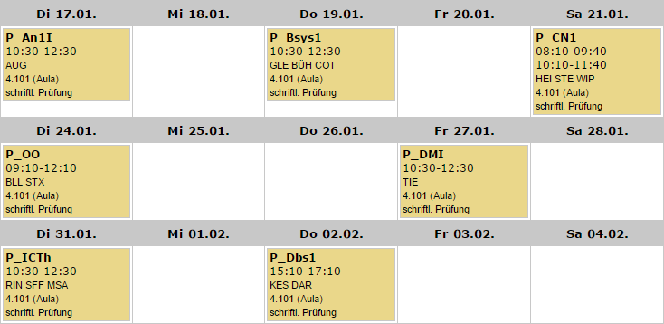

## Analysis (Di. 17. Januar) [(Moodle)](https://moodle.hsr.ch/course/view.php?id=406)

Der Prüfungsstoff umfasst das gesamte Skript ohne die im Inhaltsverzeichnis mit einem Stern (\*) gekennzeichneten Kapitel.

Prüfungsablauf

- Bitte warten Sie vor dem Prüfungsraum, bis Sie hereingebeten werden und setzen Sie sich an eines der Pulte, auf denen ein Aufgabenblatt bereit liegt.
- Die Prüfung dauert 120 Minuten.
- Wenn Sie mit Verspätung, aber noch vor Ende der Prüfung eintreffen, dürfen Sie die Prüfung ablegen. Die Prüfung endet aber für alle Studierenden zur gleichen Zeit.
- Sie können die Prüfung nur bis max. 20 Minuten vor Prüfungsende vorzeitig abgeben. Falls Sie Ihre Prüfung in den letzten 20 Minuten der Prüfungszeit beenden, bleiben Sie bitte im Interesse Ihrer Kollegen bis zum Ende der Prüfung an Ihrem Platz sitzen und geben erst dann die Prüfung ab.
- Die Prüfung ist __ohne Unterlagen__ und ohne elektronische Hilfsmittel zu lösen.
- Das Mobiltelefon oder der PDA ist vor Beginn der Prüfung vollständig auszuschalten, um Störungen zu vermeiden, und darf sich nicht auf dem Pult befinden.
- Das Papier und das Schreibwerkzeug für die Lösungen ist selber mitzubringen. Es darf mit einem beliebigen Schreibwerkzeug geschrieben werden mit Ausnahme von Rotstifft (Korrekturfarbe).
- Bringen Sie Ihre Legi-Karte mit und legen Sie diese auf das Pult. Im Übrigen dürfen auf dem Pult neben den Aufgaben- und Lösungsblättern nur die Schreibutensilien und eine Uhr liegen.

[src](https://moodle.hsr.ch/mod/page/view.php?id=11893)

## Betriebssysteme (Do. 19. Januar) [(Moodle)](https://moodle.hsr.ch/course/view.php?id=690)

Prüfungsinhalte

- Inhalte sämtlicher Vorlesungsfolien (siehe Moodle-Kurs "Betriebssysteme-1")
- Inhalte sämtlicher Übungen (siehe Moodle-Kurs "Betriebssysteme-1")

Inhaltsübersicht anhand Lehrbuch E. Glatz, Betriebssysteme, 3. Auflage

- Einführung
 - _Kap. 1.1 - 1.4: S. 1 - 9_
- Grundlagen der Programmausführung:
 - _Kap. 2: S. 25 - 69_
- Systemprogrammierung:
 - _Kap. 3: S. 71-72, 79-104 (ohne Kap. 3.1)_
- Prozesse und Threads, CPU Scheduling
 - _Kap. 4.1, 4.2.1-4.2.6, S. 105-128_
 - _Kap. 4.3 (ohne Windows Fibers), S. 135-146, 148-151_
 - _Kap. 4.4.1 - 4.4.4 (ohne RM- & EDF-Strategie), S. 151-166, 168-170_
- Synchronisation von Prozessen & Threads
 - _Kap. 5.1 - 5.3 (ohne POSIX-Rwlock) , S. 189 - 216_
 - _Kap. 5.4 (nur POSIX Mutex und Windows Mutex/Semaphore/Crit. Sect. Object) , S. 216 - 226_
 - _Kap. 5.5, S. 226 - 235_
 - _Kap. 5.6: S. 235 - 247_
- Kommunikation von Prozessen & Threads
 - _Kap. 6.1 – 6.2.2: S. 251 - 267_

Prüfungsbedingungen

- Prüfungsdauer: 120 Min
- Erlaubte Hilfsmittel:
 - Lehrbuch „Betriebssysteme“ von E. Glatz (dpunkt.verlag 2015/2010/2006), alternativ Ausdrucke (Printouts) des E-Books
 - Printout der Datei „Uebersicht_Systemaufrufe.pdf“
 - Büchlein „C kurz & gut“ von P. Prinz & U. Prinz-Kirch, O‘Reilly, 2002
 - Taschenrechner
- NB: Bücher dürfen Handnotizen enthalten
- Nicht erlaubt sind Zusammenfassungen, Übungsblätter und Lösungen, alte Prüfungen sowie kommunikationsfähige Geräte jeglicher Art.
- Es können während der Prüfung keine Fragen an die Prüfungsaufsicht gestellt werden. Nötigenfalls sind sinnvolle Annahmen zu treffen und zu begründen.
- Alle Lösungen sind auf die abgegebenen Aufgabenblätter zu schreiben, da Zusatzblätter zur Bewertung nicht entgegengenommen werden. Zusatzblätter können jedoch während der Prüfung zur Notierung von Zwischenresultaten benutzt werden. 

[src](https://moodle.hsr.ch/pluginfile.php/44765/mod_resource/content/6/PruefungsInfo_Bsys1_HS16.pdf)

## Computernetze (Sa. 21. Januar) [(Skripte)](https://skripte.hsr.ch/Informatik/Fachbereich/Computernetze_1/CN1/)

- Achtung: cn1 ist ein «b-Modul»
-- muss bestanden werden
-- Beachte: Sie haben nur 2 Versuche!
- Zulassungsbedingung
 - 6 der 7 Praktika (Versuche) erfolgreich bearbeitet
- Inhalt
 - Theorie, Übungen, Praktikum, Selbststudium
 - W=Wissensfragen, V=Verständnisfragen, U=Umsetzungsfragen, Evtl. einige Aufgaben direkt am Computer
- Prüfungsdurchführung
 - 1.5h Teil 1, 30min Pause, 1.5h Teil 2
 - Ohne Unterlagen, ohne elektronische Hilfsmittel (Taschenrechner, Smartphone, …)
 - Termin Mitte Januar
- Empfehlung: Die aktuellste Beispielprüfung bereits während dem Semester parallel zur Vorlesung lösen

[src](https://skripte.hsr.ch/Informatik/Fachbereich/Computernetze_1/CN1/Vorlesungsunterlagen/0-Moduleinfuehrung.pdf)

## Objektorientertes Programmieren (Di 24. Januar) [(Skripte)](https://skripte.hsr.ch/Informatik/Fachbereich/Objektorientierte_Programmierung/OO/)

- Schriftliche Prüfung während der Prüfungssession, 180 Minuten
- Zulassungsbedingungen: Testat (siehe oben)
- Erlaubte Hilfsmittel während der Prüfung
 - Ein A4 Blatt (doppelseitig beschrieben oder bedruckt)
- Kein Quicksort, GC, Reflection

[src](https://skripte.hsr.ch/Informatik/Fachbereich/Objektorientierte_Programmierung/OO/Allgemeine_Informationen_OO.pdf)

## Diskrete Mathematik (Fr. 27. Januar) [(Skripte)](https://skripte.hsr.ch/Mathematik_Naturwissenschaften/Diskrete_Mathematik_fuer_Informatik_/DMI/)

Inhalt

- Grundlagen
 - Logikaufgabe mit anwenden der Rechenregeln
 - Mengenlehre
 - Vollständige Induktion
- Modulo-Rechnen
 - RSA (vereinfacht, da sonst zu schwierig => man muss wissen wie es funktioniert)
 - Alles berechnen können
- Lineare Algebra
 - Lineares Gleichungssystem
 - Normalenform
 - Abbildungen
 - Inverse und Determinante

Ramenbedingungen:

- 2h
- c.a. 15 minuten pro Aufgabe an je 15 Punkten => 1 Punkt pro Minute
- 120 Punkte für eine 6.0
- 9 Aufgaben => Max. Punktzahl ist 135 => eine Aufgabe muss nicht gelöst werden für eine 6.0
- 66 Punkte für eine 4

Hilfsmittel:

- Skript mit Notizen
- Keine eigene Formelsammlung
- Man bekommt eine Formelsammlung (Server Theoriekapitel)
- Buch
- KEIN TASCHENRECHNER

## Informations- und Codierungstheorie (Di. 31. Januar) [(Skripte)](https://skripte.hsr.ch/Informatik/Fachbereich/Informations-_und_Codierungstheorie/ICTh/)

Unterteilt in Steffen und Rinkel:

Steffen:

- Alle Unterlagen ausser alte Tests
- Teil mobilequiz-ähnlich, Teil unterrichtsbezogen

Rinkel:

- Ein Teil komplett _ohne Unterlagen_ (Ankreuztest)
- Ein Teil _mit allen Unterlagen + Taschenrechner_
 - Formelsammlung
 - Folien mit Ergänzungen

src: Lektion

## Datenbanksysteme (Do. 2. Februar) [(Moodle)](https://moodle.hsr.ch/course/view.php?id=590)

- __Hilfsmittel__: Ein A4-Blatt, doppelseitig bedruckt
- Abgesetzte Schriftliche Prüfung à 120 min.
- Prüfungs-Unterlagen:
 - Ein A4-Blatt Zusammenfassung, doppelseitig bedruckt; ohne spezielle Hilfsmittel lesbar
- Prüfungsstoff-Umfang und -Stil:
 - Gesamter Vorlesungsinhalt inklusive Übungen
 - Konzeptverständnis
 - SQL
 - Programmieraufgaben JDBC (Java)
- Prüfungsvorbereitung: Moodle beachten!

[src](https://skripte.hsr.ch/Informatik/Fachbereich/Datenbanksysteme_1/Dbs1/Vorlesung/00_Organisatorisches/Dbs1_Organisation.pdf)
