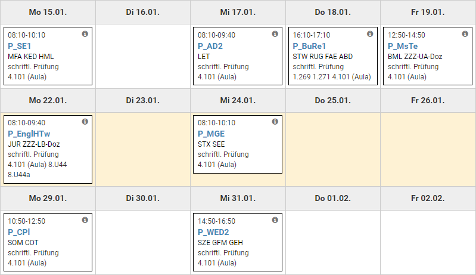

## Software-Engineering (Mo. 15. Januar) [(Moodle)](https://moodle.hsr.ch/course/view.php?id=1076)

* The written examination will be **closed book**.
* It is advisable to bring a pencil and eraser for the modelling exercises.
* The use of red ink is not permitted.
* The examination will consist of two separate parts. One part for each docent:
  * Part 1 of the exam will consist of questions from Farhad Mehta, and will be in English (answering is German is permitted).
  * Part 2 of the exam will consist of question from Daniel Keller, and will be in German.

[src](https://moodle.hsr.ch/mod/page/view.php?id=40041)

## Algorithmen und Datenstrukturen 2 (Mi. 17. Januar) [(Skripte)](https://skripte.hsr.ch/Informatik/Fachbereich/Algorithmen_und_Datenstrukturen_2/AD2/)

* Es dürfen **beliebige Papierunterlagen** verwendet werden.
* Fragen zur Prüfung können per EMail bis drei Tage vor der Prüfung gestellt werden.
* Stoff
  * Der im Unterricht und Übungen durchgenommene Stoff mit Ausnahme von JUnit.

[src](https://skripte.hsr.ch/Informatik/Fachbereich/Algorithmen_und_Datenstrukturen_2/AD2/5_Pruefung/1_InformationenZurPruefung_v1.0.pdf)

## Recht (Do. 18. Januar) (infos in Emails)

## DotNet Technologien [(Skripte)](https://skripte.hsr.ch/Informatik/Fachbereich/DotNet_Technologien/MsTe/)

* Alle Unterlagen sind zugelassen. Davon ausgenommen sind Musterprüfungen und Aufgabensammlungen (z.B. Übungen & Repetitionsfolien

[src](<https://skripte.hsr.ch/Informatik/Fachbereich/DotNet_Technologien/MsTe/04_Pruefung/2018-01%20DotPruef%20Info%20(Korrektur%2001).pdf>)

## English: How Things Work (Mo. 22. Januar) [(Skripte)](https://skripte.hsr.ch/Kommunikation_Wirtschaft_Recht/English_How_Things_work/EnglHTw/)

## Mobile and GUI Engineering (Mi. 24. Januar) [(Skripte)](https://skripte.hsr.ch/Informatik/Fachbereich/Mobile_and_GUI_Engineering/MGE/)

* 10-seitige Zusammenfassung pro Teil (Android und WPF)

[src](https://skripte.hsr.ch/Informatik/Fachbereich/Mobile_and_GUI_Engineering/MGE/Informationen%20zur%20Pr%c3%bcfung.pdf)

## C Plus Plus (Mo. 29. Januar) [(Website)](https://wiki.ifs.hsr.ch/CPlusPlus/wiki.cgi?CPlusPlus)

## Web Engineering und Design 2 (Mi. 31. Januar) [(Skripte)](https://skripte.hsr.ch/Informatik/Fachbereich/Web_Engineering_+_Design_1/WED1/)

* Grid
* OO
* Typescript
* Testat
